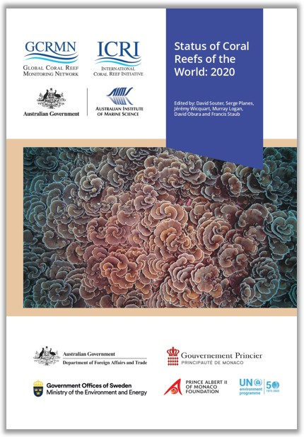

<!-- README.md is generated from README.Rmd. Please edit that file -->

```{r, include = FALSE}
knitr::opts_chunk$set(
  collapse = TRUE,
  comment = "",
  out.width = "100%"
)
options(tibble.print_min = 5, tibble.print_max = 5)
```

# **Status of Coral Reefs of the World: 2025**

## 1. Introduction [](https://gcrmn.net/2025-report/)

Lorem ipsum dolor sit amet, consectetur adipiscing elit. Sed non risus.
Suspendisse lectus tortor, dignissim sit amet, adipiscing nec, ultricies
sed, dolor. Cras elementum ultrices diam. Maecenas ligula massa, varius
a, semper congue, euismod non, mi. Proin porttitor, orci nec nonummy
molestie, enim est eleifend mi, non fermentum diam nisl sit amet erat.
Duis semper. Duis arcu massa, scelerisque vitae, consequat in, pretium
a, enim. Pellentesque congue. Ut in risus volutpat libero pharetra
tempor. Cras vestibulum bibendum augue. Praesent egestas leo in pede.
Praesent blandit odio eu enim. Pellentesque sed dui ut augue blandit
sodales. Vestibulum ante ipsum primis in faucibus orci luctus et
ultrices posuere cubilia Curae; Aliquam nibh. Mauris ac mauris sed pede
pellentesque fermentum. Maecenas adipiscing ante non diam sodales
hendrerit.

Ut velit mauris, egestas sed, gravida nec, ornare ut, mi. Aenean ut orci
vel massa suscipit pulvinar. Nulla sollicitudin. Fusce varius, ligula
non tempus aliquam, nunc turpis ullamcorper nibh, in tempus sapien eros
vitae ligula. Pellentesque rhoncus nunc et augue. Integer id felis.
Curabitur aliquet pellentesque diam. Integer quis metus vitae elit
lobortis egestas. Lorem ipsum dolor sit amet, consectetuer adipiscing
elit. Morbi vel erat non mauris convallis vehicula. Nulla et sapien.
Integer tortor tellus, aliquam faucibus, convallis id, congue eu, quam.
Mauris ullamcorper felis vitae erat. Proin feugiat, augue non elementum
posuere, metus purus iaculis lectus, et tristique ligula justo vitae
magna.

Aliquam convallis sollicitudin purus. Praesent aliquam, enim at
fermentum mollis, ligula massa adipiscing nisl, ac euismod nibh nisl eu
lectus. Fusce vulputate sem at sapien. Vivamus leo. Aliquam euismod
libero eu enim. Nulla nec felis sed leo placerat imperdiet. Aenean
suscipit nulla in justo. Suspendisse cursus rutrum augue. Nulla
tincidunt tincidunt mi. Curabitur iaculis, lorem vel rhoncus faucibus,
felis magna fermentum augue, et ultricies lacus lorem varius purus.
Curabitur eu amet.

## 2. Code

### Cleaning and selection (`a_`)

* `a01_select_benthic-data.R` Extract benthic cover data from [gcrmndb_benthos](https://github.com/GCRMN/gcrmndb_benthos).
* `a02_clean_intersect-reefs.R`
* `a03_benthic-data_sources.R` Extract lists of datasetID and contributors details.
* `a04_clean_buffer-reefs.js` Create coral reef buffer polygons at 5, 20, 50, and 100 km using [GEE](https://earthengine.google.com/).
* `a05_clean_cyclones.R` Clean cyclones data.
* `a06_download_crw-year.R` 

### Indicators' extraction (`b_`)

* `b01_extract_population.js` Extract population indicators using [GEE](https://earthengine.google.com/). 
* `b02_extract_crw.R` Extract SST indicators.
* `b03_extract_cyclones.R` Extract cyclones indicators.
* `b04_region-characteristics.R` Extract region characteristics.

### Models (benthic cover) (`c_`)

* `c01_explo_benthic-data.qmd` Exploratory analyses of benthic cover data.
* `c02_select_pred-sites.R`     
* `c03_extract_predictor_gee.js`
* `c04_extract_predictor_gravity.R`
* `c05_extract_predictor_enso.R`
* `c06_extract_predictor_cyclones.R`
* `c07_extract_predictor_crw.R`
* `c08_model_data-preparation.R`
* `c09_xgboost-model.R`
* 
* `c11_format-results.R`

### Figures and tables (`d_`)

* `d01_geography-maps.R`     
* `d02_spatio-temporal.R`
* `d03_cyclones.R`
* `d04_crw.R`
* `d05_population.R`
* `d06_reef-extent.R`
* `d07_benthic-cover_trends.R`
* `d08_case-studies.R`

### Writing and sharing (`e_`)

* `e01_generate_docx.R`
* `e02_authors-contribution.R`

### Functions

* `data_descriptors.R` Get number of sites, surveys, datasets, first and last year of monitoring.
* `docx_chapter.Rmd` Template to generate the .docx regional chapters.
* `docx_supp-mat.Rmd` Template to generate the .docx Supplementary Materials.
* `extract_coeff.R` Extract slope from linear regression.
* `graphical_par.R` Graphical parameters, including colors and fonts.
* `map_region_geography.R` Map of region (geography).
* `map_region_monitoring.R` Map of region (monitoring).
* `map_sphere.R` Map of region (sphere).
* `plot_trends_model.R` Plot temporal trends from models.
* `plot_trends_raw.R` Plot temporal trends from raw data.
* `prepare_benthic_data.R` Prepare benthic cover data for models.
* `styles.docx` Word document styles.
* `theme_graph.R` Main ggplot theme for the plots of the reports.
* `theme_map.R` Main ggplot theme for the maps of the reports.

## 3. Reproducibility parameters

```{r echo=FALSE, message=FALSE}

# 1. Print session info ----

devtools::session_info(c("sf", "tidyverse", "tidymodels"))

```
